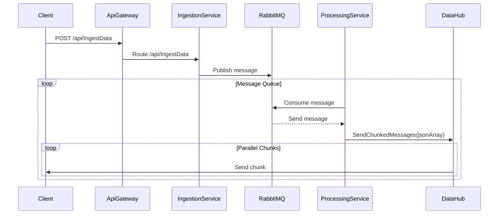

# IoTDeviceDataIngestor

## Description
This project is just a demo project involving SignalR, RabbitMQ and Docker technologies.

The gateway of `IoTDeviceDataIngestor.ApiGateway` receive data from a fictional IoT device through the following REST API:

### IngestData API IA
* **Route**: /api/IngestData
* **Method**: POST
* **Content-Type**: application/json

#### Request
The request is a generic array of generic object, this is due to the demo purpose of this project.
```json
[
    {
        "data1": "string",
        "data2": 0.0,
        //...
    }
]
```

The controller defined in the `IoTDeviceDataIngestor.IngestionService` send the request to a RabbitMQ queue, there another service, the `IoTDeviceDataIngestor.ProcessingService` is listening on this queue which chunk the element content in it, and through **SignalR** sends message in parallel, for each chunk also executed in parallel, to all the client listening to the following REST API:

### ProcessedData API IA
* **Route**: /api/dataHub
* **Method**: GET

#### Response
The response is, like the request of the POST API, a generic array of generic object, this is due to the demo purpose of this project.
```json
[
    {
        "data1": "string",
        "data2": 0.0,
        //...
    }
]
```

## Environment Variables and Secrets
You need to value the folling environment variables:
#### Repository Variables
| Key | Value | Description |
| -- | -- | -- |
| API_GATEWAY_HOST | **<VALUE>** | The host name you are given |
| ASPNETCORE_ENVIRONMENT |  **<VALUE>** | Depends by the environment, could be `Development` or `Production` |
| QUEUE_NAME |  **<VALUE>** | The name of your RabbitMQ queue |
| RABBITMQ_HOSTNAME |  **<VALUE>** | The name of your RabbitMQ Host |

## Sequence Diagram

